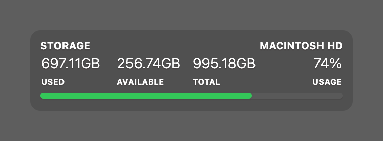

# Storage Usage

[](https://creativecommons.org/licenses/by-nc/4.0/)

A storage usage widget for [Übersicht](http://tracesof.net/uebersicht/). It shows your main disk's used, available, and total space plus percentage used, with a fill bar that changes color as the disk fills up (ok → warn → elevated → critical). Colors are theme-aware, with sensible built-in defaults, so the widget works on its own.

## Screenshot



## Options

A couple of options can be changed by editing `index.coffee`:

```coffeescript
  # Toggle a history graph panel on/off (adds a second panel beside the stats).
  showGraph: false

  # Which disk from `df -l` to report (1-based row index).
  disk_index: 8
```

## Installation

- Download the [repository](https://github.com/dionmunk/uebersicht-storage-usage/archive/master.zip) and extract it.
- Place the `storage-usage.widget` folder in your Übersicht extension folder.
- Refresh Übersicht.

## Theming

This widget is theme-aware. Its colors come from CSS custom properties (text, panel tint, status and series colors) with sensible built-in fallbacks, so it looks right on its own. Install the [Theme Controller](https://github.com/dionmunk/uebersicht-theme-controller) widget and this one automatically follows its color scheme and light/dark mode, staying in sync with the rest of the collection.

## License

This work is licensed under a [Creative Commons Attribution-NonCommercial 4.0 International License](https://creativecommons.org/licenses/by-nc/4.0/).
